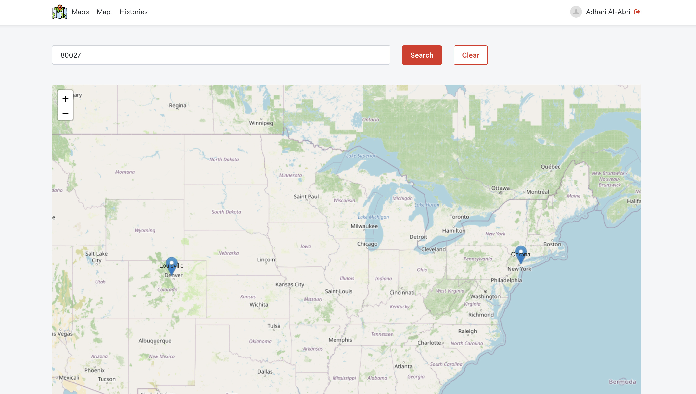
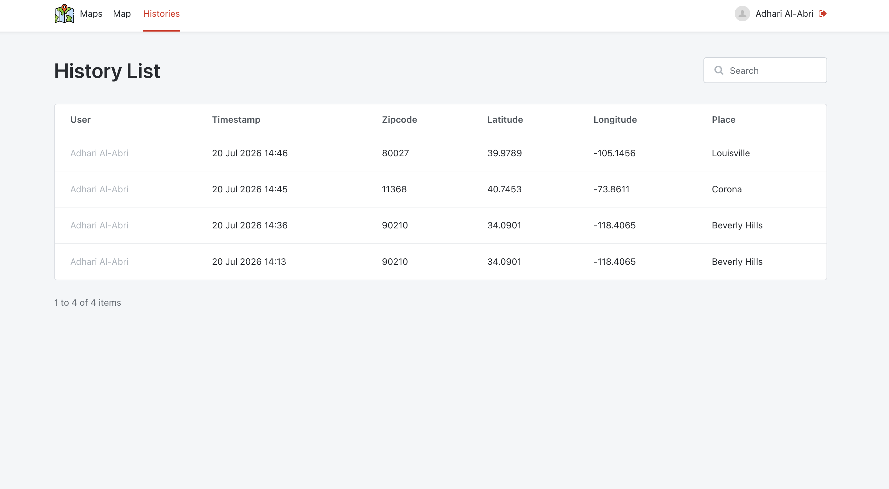

# OutSystems-Maps

A simple web application built with **OutSystems** that allows users to search for a location using a ZIP code and visualize the result on an interactive **Leaflet** map.

The application retrieves real-time location information from the **Zippopotam.us API**, places a marker on the map, and automatically stores every successful search in the user's history.

---

## Live Demo

https://personal-aj6wpmjr.outsystemscloud.com/Maps/Login

---

## Demo Credentials

| Username | Password |
|----------|----------|
| user123 | user1234 |

---

## Features

- User authentication
- Search locations by ZIP code
- Interactive Leaflet map
- Automatic map markers
- Displays place name and coordinates
- Saves search history
- Stores search timestamp
- Search and filter history
- Clear current search
- User-specific history records

---

## Screenshots

### Login

---

### ZIP Code Search

---

### Search History

---

## 🚀 How It Works

1. Log into the application.
2. Enter a valid ZIP code.
3. Click **Search**.
4. The application sends a request to the **Zippopotam.us API**.
5. The returned location is displayed on a **Leaflet** map.
6. A history record is automatically saved.
7. View all previous searches in the **Histories** page.

---

## API Integration

This application uses the **Zippopotam.us API**.

**Base URL**

https://api.zippopotam.us/

Example Request

https://api.zippopotam.us/us/90210

Example Response

json
{
  "country": "United States",
  "country abbreviation": "US",
  "post code": "90210",
  "places": [
    {
      "place name": "Beverly Hills",
      "longitude": "-118.4065",
      "latitude": "34.0901",
      "state": "California",
      "state abbreviation": "CA" 
    }
  ]
}

---

## Map Integration

The application uses **Leaflet** to provide an interactive map.

Features include:

- Interactive map
- Automatic marker placement
- Zoom to searched location
- Multiple markers
- Coordinate visualization

---

## Search History

Each search stores the following information:

| Field | Description |
|-------|-------------|
| User | Logged in user |
| Timestamp | Date & Time of search |
| ZIP Code | Entered ZIP code |
| Latitude | Latitude from API |
| Longitude | Longitude from API |
| Place | Returned city/place |

---

## Notes

- Only valid ZIP codes are accepted.
- Data is retrieved live from the Zippopotam.us API.
- Internet access is required.
- Map tiles are provided through Leaflet/OpenStreetMap.

---

## Author

**Adhari Al-Abri**

